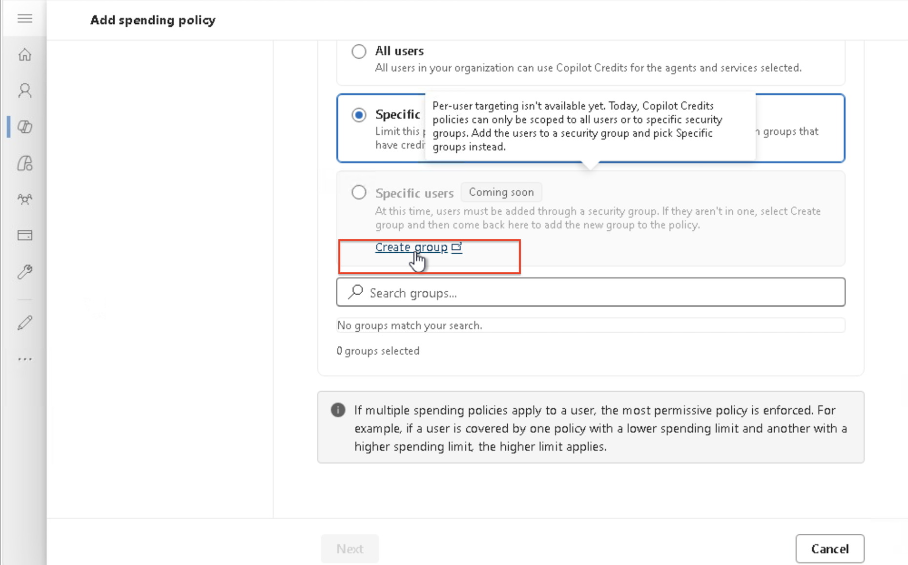
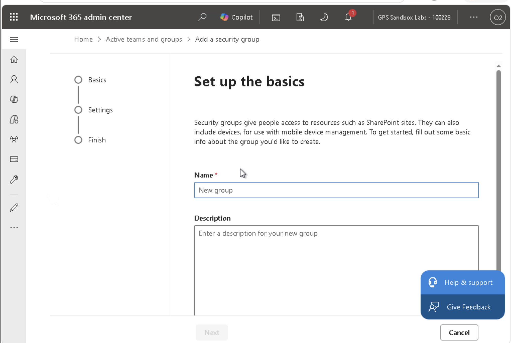
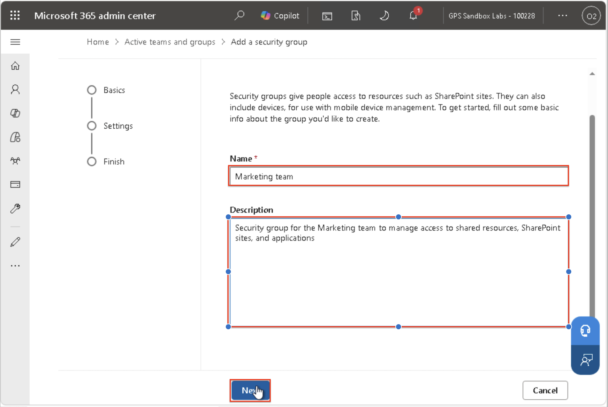
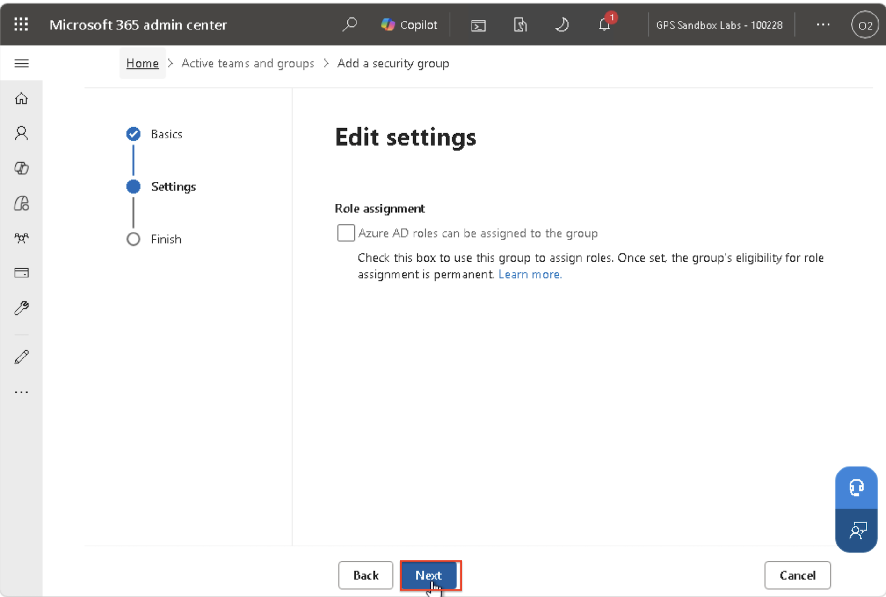
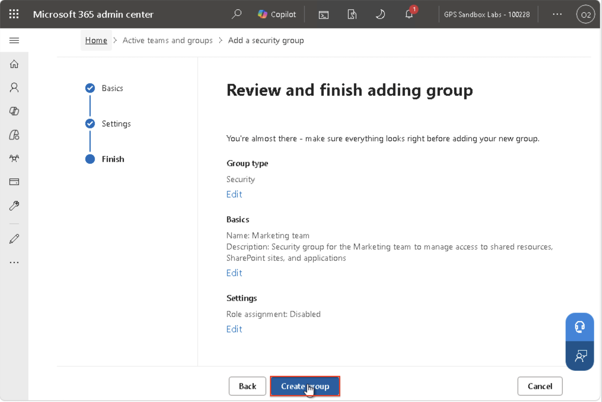

**Lab 2 guide**

**Usage-based billing and Copilot Credits**

*Microsoft 365 Copilot — cost management and Copilot Credits*

| **Field**      | **Detail**                               |
|----------------|------------------------------------------|
| Estimated time | 40 minutes                               |
| Environment    | Microsoft 365 admin center (test tenant) |

By the end of this lab, you will be able to:

- Explain how Microsoft 365 Copilot usage-based billing and Copilot
  Credits work.

- Identify which administrator roles can perform each billing task.

- Activate the default spending policy for your organization.

- Create and scope additional spending policies to specific groups.

- Configure monthly limits, per-user limits, and usage alerts.

- Understand how a user is assigned a policy when they belong to more
  than one.

- Delete a spending policy and describe what happens to affected users
  and credits.

# Prerequisites

- Access to a Microsoft 365 test or lab tenant.

- An account with the **Global administrator** or **Billing
  administrator** role (needed to set the billing method).

- At least one security group created in the tenant to use for policy
  scoping.

- A billing method available in the tenant (prepaid capacity packs or a
  pay-as-you-go Azure subscription).

<table style="width:93%;">
<colgroup>
<col style="width: 92%" />
</colgroup>
<thead>
<tr>
<th>
<strong>Note</strong>

Microsoft recommends using the role with the fewest permissions
needed. <strong>Global administrator</strong> is highly privileged — use
it only when no other role can complete the task.
</th>
</tr>
</thead>
<tbody>
</tbody>
</table>

# Background: key concepts

Microsoft 365 Copilot offers a usage-based billing model that uses
**Copilot Credits**, giving organizations a flexible pay option
alongside fixed per-user licensing. Certain AI experiences — such as
Cowork and the Work IQ API — are gated behind usage-based billing and
are unlocked when you activate a spending policy.

You manage all of this from the **Cost Management** dashboard in the
Microsoft 365 admin center, where you can allocate credits, set access
policies and limits, choose prepaid or pay-as-you-go billing, and use
budgets, alerts, and hard caps to prevent overspending.

<table style="width:93%;">
<colgroup>
<col style="width: 92%" />
</colgroup>
<thead>
<tr>
<th>
<strong>Disclaimer — all values shown are for demonstration
only</strong>

Every credit amount, spending limit, alert threshold, policy name,
per-user limit, notification recipient, and reset cadence used
throughout this lab — including the 500-credit policy limit, the
200-credit pool with a 100-credit per-user cap, the 40-credit-per-user
calculation for a 5-person pilot group, and the 80% alert threshold — is
illustrative only. When configuring these settings in your own
environment, base every value on your organization's actual team size,
historical usage patterns, and budget requirements. Do not copy the
numbers or names used in this lab directly into a production
tenant.
</th>
</tr>
</thead>
<tbody>
</tbody>
</table>

## Roles and permissions

| **Role** | **Can do** | **Cannot do** |
|----|----|----|
| **Global administrator** | Add, select, or change billing methods; set billing methods in policies; all policy tasks. | — |
| **Billing administrator** | Add, select, or change billing methods; set billing methods in policies. | — |
| **AI administrator** | Create spending policies; manage limits and alerts; view the Cost Management dashboard. | Set or modify the billing method. |
| **License administrator** | Create spending policies; manage limits and alerts; view the Cost Management dashboard. | Set or modify the billing method. |

<table style="width:93%;">
<colgroup>
<col style="width: 92%" />
</colgroup>
<thead>
<tr>
<th>
<strong>Tip</strong>

Before each exercise, check which role is required. Exercises 1 and 4
(billing method changes) need Global or Billing administrator. Exercises
2 and 3 can be done by AI or License administrators.
</th>
</tr>
</thead>
<tbody>
</tbody>
</table>

# Exercise 1 — Activate the default spending policy

*In this exercise you unlock the AI experiences enabled by usage-based
billing by activating your organization's default spending policy.*

### Required role: Global administrator or Billing administrator

1.  Sign in to the [<u>Microsoft 365 admin
    center</u>](https://admin.cloud.microsoft/?#/homepage)
    (admin.microsoft.com) using a **Global administrator** or **Billing
    administrator** account.

2.  In the left navigation, go to **Copilot**, and then select the
    **Cost Management** node.

3.  On the **Cost Management** dashboard, select **Get started** to
    begin unlocking AI experiences (currently available for Cowork and
    the Work IQ API).

4.  A center panel titled **Activate the default spending policy for
    your organization** opens.

5.  In the **Billing method** section, select how your organization is
    billed for Copilot Credit usage, and choose the default
    subscription. This subscription becomes the default for other
    policies you create later.

- **Select the recommended billing method:** Pay-as-you-go policy.

- **Subscription:** OTU WA MSB - 106261.

6.  In the **Set the monthly spending limit for this policy** section,
    choose one option:

    - **Don't limit monthly spending** — the policy uses credits against
      the billing method without restriction.

    - **Limit monthly spending** — caps the number of credits the
      default policy can spend each month.

**Note:** in this exercise we select the second option, Limit monthly
spending.

7.  In the **Select the monthly spending limit for users (optional)**
    section, set a per-user monthly limit so no single person can spend
    all available credits. Although optional, you should set this to
    prevent runaway spending. The monthly budget is set to 200 in this
    exercise.

8.  In the **Define alerts** section, choose who receives an email when
    usage reaches your chosen threshold, then set the threshold. Alert
    emails begin at the threshold and repeat weekly until the month
    resets or you change the limits.

9.  Set the toggle to enabled to turn on **Define alerts**, then
    configure the recipients and threshold below.

**Configure the following:**

- **Send email to the following users:** ODL_User2336790. These
  recipients receive the alert email when the threshold is met. Remove
  the second user and proceed with the ODL user to receive the alerts.

  - To remove a user from the alert recipient list, select the **X**
    (cross mark) next to their name.

  - To add a new recipient, select **+ Add recipient**, then search for
    and select the user you want to add.

- **Alert when monthly spending reaches:** 200.

- **Unit:** Credits or Percentage.

### When to use each alert unit

**Percent of limit** — the alert threshold is expressed as a percentage
of whatever the monthly limit is set to.

- Use this when you want the alert to scale automatically if you later
  change the credit limit.

- Example: set it to 80%. If the limit is 100 credits, the alert fires
  at 80 credits used. If you later raise the limit to 150, the alert
  fires at 120 credits — no need to touch this field again.

**Credits** — the alert threshold is a fixed, absolute number,
independent of the limit.

- Use this when you want a hard number regardless of what the limit is
  set to.

- Less common for ongoing policies, since it doesn't auto-adjust if the
  limit changes later.

**Note:** to add another user in addition to the ODL user, select **+
Add recipient** and choose the new user from the dropdown.

10. Select **Activate** (blue button) when you are happy with everything
    configured on screen — the monthly limit, the alert recipients, and
    the alert threshold — and you want to turn the policy on as-is with
    default settings applied everywhere else.

11. Select **Customize setup configuration** when you want to go deeper
    before activating. This opens additional settings not shown on the
    summary screen, such as:

- Scoping the policy to specific users or groups rather than the whole
  organization.

- Setting different limits for different groups.

- Configuring more granular alert rules.

- Adjusting which services or apps this spending policy applies to.

12. For this exercise, select **Customize setup configuration**. Here is
    why:

- **There is a credits/percent mismatch to fix.** The field shows “200
  credits ≈ 100% of budget” against a 100-credit limit, which is
  mathematically wrong (it should be either 100 credits for 100%, or
  Percent of limit set to 80).

- **Customize setup configuration** is the more reliable place to fix
  the Unit dropdown and value, because it gives you the full editing
  view rather than the summary.

13. Select the **Monthly spending limit** tab to correct the per-user
    spending limit set previously.

<table style="width:93%;">
<colgroup>
<col style="width: 92%" />
</colgroup>
<thead>
<tr>
<th>
<strong>One important difference to notice: there are two budget
limits to set up</strong>

<strong>1. Set the monthly spending limit for this policy</strong> —
the total combined credit budget for the entire All Users default
policy. Across everyone covered by this policy, combined usage cannot
exceed the set amount (for example, 200 credits per month).

<strong>2. Select the monthly spending limit for users</strong> — a
per-person sub-limit that applies to each individual user within that
same policy. No single person can spend more than this amount per month
(for example, 100 credits), even if the overall pool has room left.

<strong>How they work together</strong>

<em>Think of it as a bucket with a lid, plus a rule about how fast
any one person can scoop from it:</em>

• Total bucket size: 200 credits per month (shared across all users
on this policy).

• Per-person scoop limit: 100 credits per month (no individual can
exceed this, regardless of how much is left in the bucket).

<em>With these numbers, at most 2 people could fully exhaust the pool
in a month (2 × 100 = 200), or many people could use smaller amounts
that add up to 200 total.</em>
</th>
</tr>
</thead>
<tbody>
</tbody>
</table>

This raises a practical question: if you have a pilot group of 5 users
sharing a 200-credit pool, what should the per-user limit be?

<table style="width:93%;">
<colgroup>
<col style="width: 92%" />
</colgroup>
<thead>
<tr>
<th>
<strong>Worked example: baseline for a 5-person pilot
group</strong>

With a 200-credit total pool and 5 people sharing it, the starting
point is simple division — though the exact number depends on how strict
you want to be.

<strong>Baseline: even split — 200 ÷ 5 = 40 credits per
user.</strong>

Set the per-user limit to 40. This guarantees no single person can
consume more than their fair one-fifth share. Even if all 5 people hit
their individual cap simultaneously, total usage tops out at exactly 200
(5 × 40 = 200), matching your pool exactly with zero risk of one or two
heavy users draining the whole thing before others get a turn.
</th>
</tr>
</thead>
<tbody>
</tbody>
</table>

14. To target specific groups or change which services are governed,
    select **Customize setup configuration** before activating. Based on
    the baseline defined for 5 users, update the per-user spending limit
    to 40 credits.

- Select **Save changes** before activating.

15. Select **Activate**. You are notified that setup is complete.

16. Select **Manage configuration** to open the Configuration tab.
    Copilot consumptive services are now available.

17. Confirm that the default spending policy, **All Users Policy**, is
    now listed among the policies shown.

<table style="width:93%;">
<colgroup>
<col style="width: 92%" />
</colgroup>
<thead>
<tr>
<th>
<strong>Note</strong>

The alert recipient field pre-populates with the signed-in
administrator and suggests administrators previously selected for
billing notifications.
</th>
</tr>
</thead>
<tbody>
</tbody>
</table>

### Checkpoint

- Cowork and Work IQ API appear as available services.

- The default spending policy is listed on the Configuration tab.

# Exercise 2 — Create a scoped spending policy

*Create an additional spending policy that applies to a specific group.
There is no maximum number of policies you can create.*

### Required role: AI administrator, License administrator, Global administrator, or Billing administrator

<table style="width:93%;">
<colgroup>
<col style="width: 92%" />
</colgroup>
<thead>
<tr>
<th>
<strong>Note</strong>

The tenant-level limit you set when activating the default policy
applies to all users. Each additional policy has its own independent
limit and does not inherit the tenant-level limit.
</th>
</tr>
</thead>
<tbody>
</tbody>
</table>

## Step 1 — Scope users and groups

1.  On the **Cost Management \> Configuration** tab, select **+ Add
    spending policy**.

2.  Create and name the policy (for example, **Marketing Team
    Copilot**).

3.  Select the users or groups the policy applies to. **All users** is
    selected by default. To target a subset, switch to **Specific
    groups** and select one or more directory groups.

4.  Select **Next**.

### Step 1.1: If you don't already have the Marketing team security group, you can create one by following the steps below.

1.  Navigate to the **Create group** option listed below **Specific
    group**. The Create group window will pop up.

2.  On the **Basics** step, configure the group name and settings:

- **Name:** Marketing team

- **Description** (optional): Security group for the Marketing team to
  manage access to shared resources, SharePoint sites, and applications

- Click **Next**.

3.  On the **Settings** step, skip the role assignment and click
    **Next**.

4.  On the **Finish** step, review the details, then click **Create
    group** to finish adding the group.

<table style="width:93%;">
<colgroup>
<col style="width: 92%" />
</colgroup>
<thead>
<tr>
<th>
<strong>Tip</strong>

You can only target specific individuals through security groups. To
include a specific user, add them to a security group first, then select
that group in the policy.
</th>
</tr>
</thead>
<tbody>
</tbody>
</table>

## Step 2 — Set limits and alerts

1.  Choose the monthly spending limit for this policy:

    - **Unlimited monthly budget** — applies to the policy's users and
      groups each month with no cap.

    - **Limited monthly budget** — caps the credits this policy can
      spend each month. When users hit the limit, they lose access to
      agents and services for the rest of the month until credits reset
      on the 1st.

2.  Toggle **Select monthly budget limits for users** and set a maximum
    per-user monthly credit amount.

- **Set alert threshold value:** 100%.

- **Unit:** Percent of limit.

3.  **Define alerts:** send email to yourself or others when credits
    reach or approach your defined threshold.

4.  Select **Next**.

<table style="width:93%;">
<colgroup>
<col style="width: 92%" />
</colgroup>
<thead>
<tr>
<th>
<strong>Note</strong>

A policy always uses prepaid credits first — whether from capacity
packs or P3 plans — before moving to pay-as-you-go.
</th>
</tr>
</thead>
<tbody>
</tbody>
</table>

## Step 3 — Select agents and services

1.  Use the check boxes to select which agents and services this
    policy's users can consume credits for.

2.  Decide whether to leave the **Allow new services and agents as they
    become available** toggle on. When on, newly released
    credit-eligible agents are added to this policy automatically. Turn
    it off, or uncheck specific items, to restrict access.

3.  Select **Next**.

## Step 4 — Select billing method

1.  By default, the policy uses the billing method tied to the default
    spending policy.

**Note:** if you are a Global or Billing administrator, select
**Change** to override — for example, to bill a department against its
own capacity packs or a different Azure subscription. (AI and License
administrators cannot change the billing method.)

## Step 5 — Review and create

1.  Review all details and select **Create spending policy**.

2.  Select **Create spending policy**.

3.  Select **Done**. The policy appears in the Configuration list and
    applies to scoped users immediately.

### Checkpoint

- Your new policy is visible in the Configuration list.

- The policy is scoped to your chosen security group, with the limits
  and alerts you set.

# Exercise 3 — Edit limits and alerts

*Adjust an existing policy to respond to changing usage.*

1.  On the **Configuration** tab, select the policy you created in
    Exercise 2 (**Marketing Team Copilot**).

2.  Select **Monthly spending limit** and lower the overall monthly
    limit, then observe how the change takes effect for scoped users.

- The monthly spending limit is now reduced from 400 to 300.

- Confirm that once the limit is lowered, the threshold percentage
  changes automatically: 100% = 300 credits.

3.  Add or remove the alert recipient and set a lower threshold, then
    save.

- Select the cross mark next to the username to remove the user.

- Select **+ Add recipient** to add a new user.

4.  Confirm the updated values appear in the policy summary.

- Select Close in the top-right corner to exit the window.

<table style="width:93%;">
<colgroup>
<col style="width: 92%" />
</colgroup>
<thead>
<tr>
<th>
<strong>Tip</strong>

Alerts start at the threshold you set and repeat weekly until the
month resets or you adjust the limits — useful for catching fast
spenders early.
</th>
</tr>
</thead>
<tbody>
</tbody>
</table>

# Exercise 4 — Delete or disable a spending policy

*Learn exactly what happens when a policy is removed.*

1.  On the **Configuration** tab, select the policy created in Exercise
    2 and choose to delete or disable it.

## Disable a policy

1.  Select the **Marketing Team Copilot** policy you created from the
    policy list.

2.  Note that the current status shows as **Active**.

3.  Select the **Status** dropdown (or toggle) and change it from
    **Active** to **Disabled** to temporarily make the policy
    unavailable.

4.  Select **Save changes** to apply the update.

5.  Confirm that the status changed from Active to Disabled, then close
    the window from the top-right corner.

## Delete the policy

1.  Select the three-dots icon and choose **Delete** to remove the
    policy permanently.

2.  Confirm the deletion.

### What deletion does — and does not — do

- Users and groups tied to the policy are disassociated and can no
  longer use that policy's spending limits.

- Deleting a policy does not remove or reallocate Copilot Credits,
  because policies only define spending limits — they don't allocate
  credits.

- Any usage that occurred before deletion is still billed and appears in
  usage and reporting views.

- If a user is assigned to multiple policies via different group
  memberships, they may still have access through another applicable
  policy after deletion.

<table style="width:93%;">
<colgroup>
<col style="width: 92%" />
</colgroup>
<thead>
<tr>
<th>
<strong>Note</strong>

This is different from capacity-allocation scenarios in other admin
experiences, where capacity can be reallocated to specific environments.
In Microsoft 365 admin center usage-based billing, spending policies are
limit-based and do not allocate or reserve credits.
</th>
</tr>
</thead>
<tbody>
</tbody>
</table>

# Exercise 5 (optional) — Understand policy assignment for overlapping users

*A user can belong to several groups and therefore several policies.
This exercise helps you predict which single policy the system assigns.*

<table style="width:93%;">
<colgroup>
<col style="width: 92%" />
</colgroup>
<thead>
<tr>
<th>
<strong>Note</strong>

This value is for demonstration purposes only. The threshold you
configure should be based on your own organization's requirements,
actual usage patterns, and budget — not copied directly from this
lab.
</th>
</tr>
</thead>
<tbody>
</tbody>
</table>

When a user falls under more than one policy for the same service, the
system assigns exactly one policy using this order of precedence:

| **Order** | **Tie-breaker rule**                             |
|-----------|--------------------------------------------------|
| 1         | Highest per-user limit.                          |
| 2         | If tied, the largest overall policy limit.       |
| 3         | If still tied, the most recently created policy. |

- If a policy has no per-user limit set, its overall policy limit is
  used as the per-user value for this comparison.

- The chosen policy applies in full — settings from other policies are
  not combined.

- When a user reaches the limit within their assigned policy, they can
  request more credits but do not fall back to other policies. The
  system keeps them on the assigned policy and does not re-evaluate
  them.

### Try it — worked scenario

A user, Priya, is a member of two groups:

- **Policy A** — per-user limit 500 credits, overall limit 5,000
  credits.

- **Policy B** — per-user limit 800 credits, overall limit 3,000
  credits.

**Question:** which policy does the system assign to Priya, and why?

**Answer:** Policy B. The first tie-breaker is the highest per-user
limit (800 \> 500), so the overall limit is never compared.
